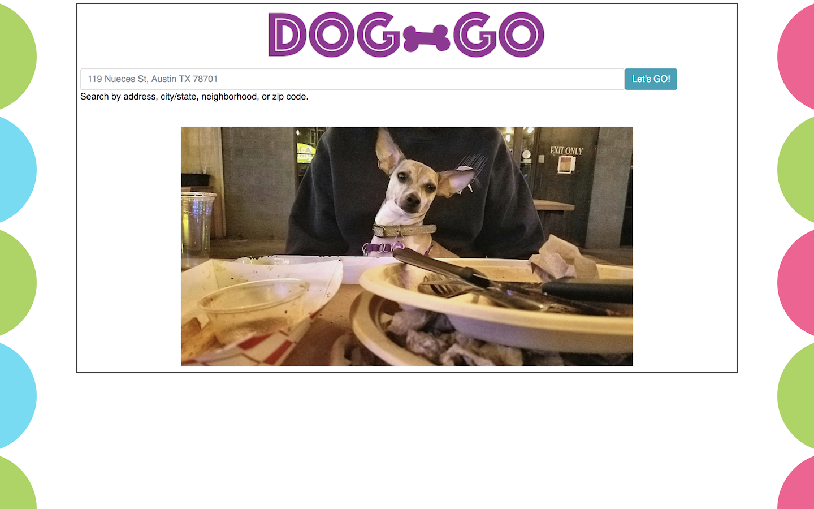
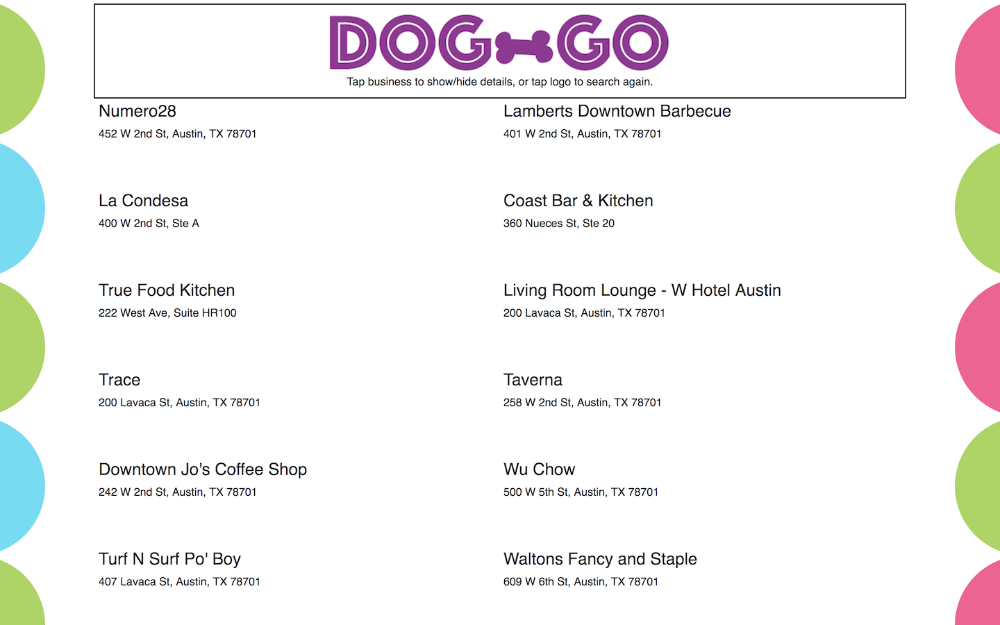
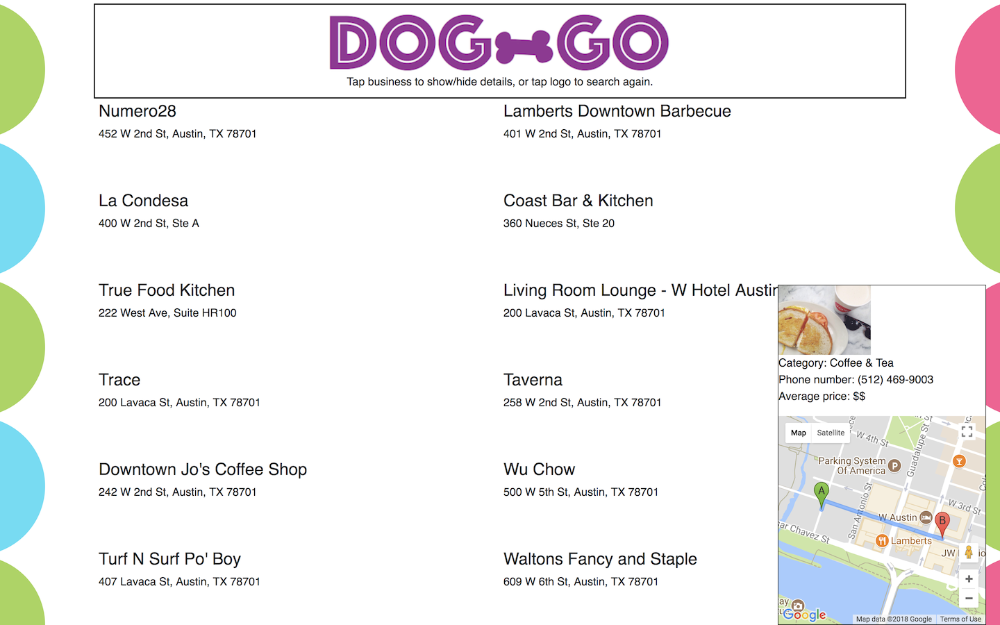

# Q1_Project

### Dog-GO finds dog-friendly restaurants and bars near you!

Dog-GO uses Yelp's API to display up to 20 dog-friendly businesses near a location that the user enters. Only restaurants and bars that are open at the time of the search are displayed, making it great for people on the go with their dogs. Using the Google Maps API, the route from the location entered to the business is displayed on a small map. Dog-GO makes it easier for people to spend more time with their pups and helps to enrich the lives of our furry best friends.

**Technologies:**
- HTML5/CSS
- Javascript
- jQuery and AJAX
- Bootstrap CSS
- CORS-anywhere (https://cors-anywhere.herokuapp.com/)
- Yelp Fusion API and Google Maps API

**Challenges:**
This was my first full app built with Javascript, but my biggest struggle actually pertained to CORS. Since there was no need to persist any data, I wanted to keep the app fully client-side. However, this made working with the Yelp and Google API's very difficult. I found the CORS Anywhere proxy, and this solved my problems.

### Walkthrough
A simple landing page loads with an input field for the address:

After the user submits the address, they're taken to a page that displays up to 20 restaurants and bars in their area.

Clicking on a business brings up more information about the business as well as a map, complete with the route from the user's location to the business.

